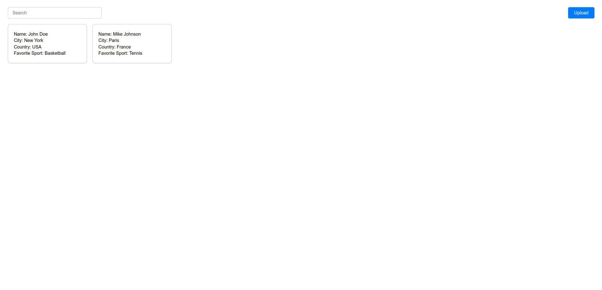
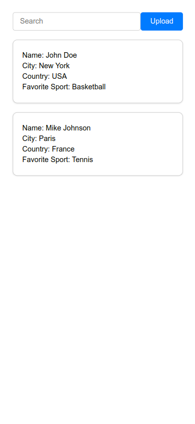

# CSV Data Viewer

Allows users to upload CSV files, which are then stored in a SQLite database, and search through the loaded CSV data.

## Table of Contents

- [Features](#features)
- [Technologies Used](#technologies-used)
- [Setup and Installation](#setup-and-installation)
- [Usage](#usage)
- [Running Tests](#running-tests)
- [Project Structure](#project-structure)
- [License](#license)

## Features

- Upload CSV files and store the data in a SQLite database.
- Search through the CSV data with a responsive frontend.
- Display search results as cards with a clean and responsive design.

## Technologies Used

- **Backend**: Node.js, Express, SQLite, Multer
- **Frontend**: React, Axios
- **Testing**: Jest, Supertest

## Setup and Installation

### Prerequisites

- Node.js (v14 or higher)
- npm (v6 or higher)

### Installation

1. Install dependencies:

    ```bash
    # For backend
    cd backend
    npm install

    # For frontend
    cd frontend
    npm install
    ```

2. Start the backend server:

    ```bash
    cd backend
    npm run dev
    ```

3. Start the frontend server:

    ```bash
    cd frontend
    npm start
    ```

The backend will run on `http://localhost:3000` and the frontend will run on `http://localhost:4000`.

## Usage

1. Open your web browser and navigate to `http://localhost:4000`.
2. Click on the button to upload a CSV file.
3. Use the search bar to filter the data based on any column.

## Screenshots

### Desktop View



### Mobile View



## Running Tests

### Frontend Tests

To run the backend tests, navigate to the backend directory and run:

```bash
cd frontend
npm test
```

### Backend Tests

To run the backend tests, navigate to the backend directory and run:

```bash
cd backend
npm test
```